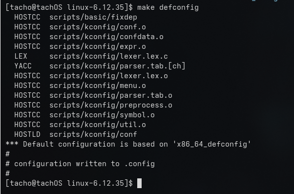
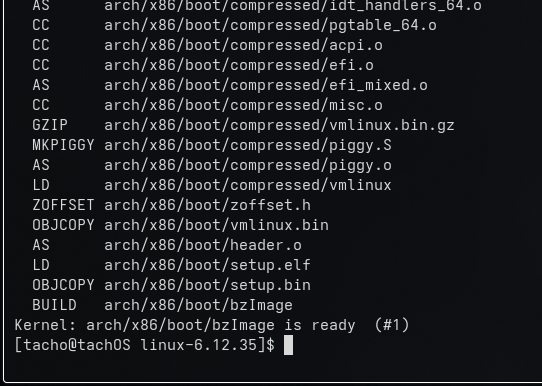
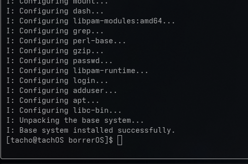
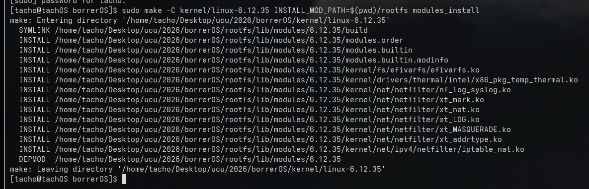
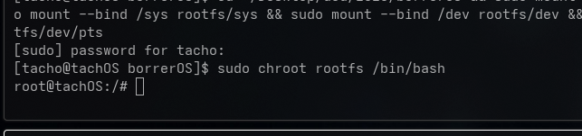
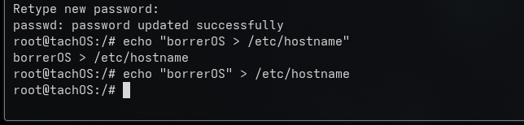

# Primeros pasos! 
Estudiante: Ignacio Silva!

Decidimos realizar una distribución lo mas desde 0 posible, partiendo del codigo fuente de linux y usando los repositorios de debian como base. 

## Dependencias

Obviamente para este tipo de desarrollos necesitamos algunas dependencias. Estos son los paquetes que tuve que instalr para empezar a ponerme un milimetro en los zapatos de torlvads! 

- `Base-devel`, `bc`, `flex`, `bison`, `libelf`, `pahole`, `perl`, `python`, `cpio`: Todas dependencias para compilar el kernel (cabe aclarar que estoy desarollando desde arch-linux y todo lo que estoy documentando en esta bitácora se basa en mi experiencia mirando de reojo el libro Linux From Scratch).
- `xmlto` doc del kernel para evitar errores en al compilacion. 
- `debootsrap`: Nos va a permitir crear el rootfs con paquetes de debian (apt!)
- `qumu-full`: Es un paquete que permite testear la imagen que compiamos sin tener que montarla en una vm y rezar.
- `grub, dosfstools, mtools`: Todo para instalar el bootloader en la img resultante.  

## El kernel (AAAAAAAAA)

Sinceramente estoy emocionado de compilar por primera vez en mi vida el kernel del linux. Elegí una versión estable porque no queremos mas rompederos de cabeza, la versión LTS (longterm). 

En el repositorio, el kernel se encuentra comprimido con la querpeta `kernel/`

para descarparlo utilice el siguiente comando como indican los docs en el repo oficial: 
`wget https://cdn.kernel.org/pub/linux/kernel/v6.x/linux-6.12.35.tar.xz`

y para descomprimirlo utilice tar. 

`tar xf linux-6.12.35.tar.xz` 

## HACER LA CONFIG! 
Como los tiempos son acotados, me voy a valer de un comando de una de los paquetes que instale antes. con `make defconfig` generamos una config minima genérica apra la arquitectura x86_64 que vamos a poder levantar con `QEMU` y verificar si salio todo bien :)

 

es literalmente lo mas generico posible pero ahora. es momento deo COMPILAR 

## COMPILAR 

para conpilarlo simplemente vamos al directorio del kernel y escribimos `make -j8` 

El flag `j` se usa para indicar cunatos archivos debe compilar a la vez y esto debería concidir con el número de núclos que tenemos y yo tengo solo :( 

 

## ROOTFS 
basicamente el entorno para usar el SO, como vamos a usar paquetes apt, hay que botstrappear el sistema de debian para que funcionen sus paqquetes. 

`sudo debootstrap --variant=minbase bookworm rootfs http://deb.debian.org/debian/`

 

## Pausa 

Aca hicimos una banda de cosas. Lo último fue compilar el kernel y despues hacer que debian traiga su arquitectura base. pero esta ultima no tiene kernel asi que tenemos que copiar lo que compilamos antes. 

## Copiamos nuestra img de linux y configuramos el rootfs 

Para eso ejecute el siguiente comando: 

`sudo mkdir -p rootfs/boot && sudo cp kernel/linux-6.12.35/arch/x86/boot/bzImage rootfs/boot/vmlinuz-6.12.35`

basicamente le estoy diciendo el entorno que botee desde la img que compuilamos antes. 

Ahora necesitamos integrar todo, el rootfs de debian con el kernel. para eso instalamos los modulos a nuestra pequeña distro 

`sudo make -C kernel/linux-6.12.35 INSTALL_MOD_PATH=$(pwd)/rootfs modules_install`




## Ahora mismo tenemosd un sistema linux FU NC IONAL

para entrar el rootfs que creamos hay que usar chroot (como en al instalacion de arch jiji) 

Este paso es medio identico porque hay quye montar directorios pero no en mi hardware sino que van a ocupar mi ram, son "virtuales".

`sudo mount --bind /proc rootfs/proc` para los procesos del sistema 

`sudo mount --bind /sys rootfs/sys` para info sobre el hardware y los drivers 

`sudo mount --bind /dev rootfs/dev` para los dispositivos  

`sudo mount --bind /dev/pts rootfs/dev/pts`  para las terminales virtuales de nuestro entorno (cuando entro por ssh a una vm se crea un archivo aca.)

## PRIMERA VEZ EN LA HISTORIA QUE ALGUIEN USA borrerOS 

`sudo chroot rootfs /bin/bash`


si esto no es el aura el aura donde esta


## Ahora vamo hacer lo que hacmos probablemente en instalaciones limpias como arch o similares. 

### setear password para el admin 

`passwd root`

### Y ahora el momento historioco, cambiar el hostname 

` echo "borrerOS > /etc/hostname"`



### fstab 

`echo "/dev/sda1 / ext defaults 0 1 > /etc/fstab"`

Basicamente para que el kernel sepa donde montar las particiones de los dispositiv0s cuando lo corramos una vm. por ej en /dev/sda1 

### initramfs 

Es una mini-img del kernel que se carga para montar las particiones y demas, sin esto cuando carguemos de verdad el kernel no va a saber donde esta el rootfs y tira un kernel panic  

Como somos debian users usamos apt!

`apt update`

`apt install -y inittramfs-tools `


Despues que instala hay que usar ese paquete para gener el inittramfs a partir de nuestro kernel. 

`mkinitramfs -o /boot/initrd.img-6.12.35 6.12.35`
o
`/usr/sbin/mkinitramfs -o /boot/initrd.img-6.12.35 6.12.35`

Yo tuve que tirar el segundo comando porque no configuramos todavia que los paquetes instalados se agreguen al path jiji

### ERROR 

Y ACA ESTA EL PRIMER ERROR: 
```
root@tachOS:/# /usr/sbin/mkinitramfs -o /boot/initrd.img-6.12.35 6.12.35
grep: /boot/config-6.12.35: No such file or directory
W: zstd compression (CONFIG_RD_ZSTD) not supported by kernel, using gzip
grep: /boot/config-6.12.35: No such file or directory
E: gzip compression (CONFIG_RD_GZIP) not supported by kernel
```

Aunque en un hilo de reddit descubir que era porque no le estaba psasando la config de mi kernel para que mkinit pudiera recrearlo jaj. asi que tuve qe salir de `borrerOS`, copiar la config y volver a entrar. 

Me tiro un monton de warnings pero fingimos demencia!. 

## Instalarle grub a borrerOs 
`apt install -y grub-pc`

### (tengo que agarrar el omnibus a las 22.30 para ir a la bella asi que hasta aca llegue. Allá compilo la img!"")


Ignacio Silva. 


