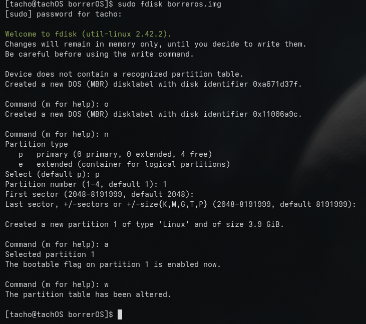

# Segunda sesión 
UNa vez configurado todo lo que dice en FirstSteps.md podemos dar el paso a crear una `img` booteable. 

## Crear la img vacía 
`dd if=/dev/zero of=borreros.img bs=1M count=4000 status=progress`

Con esto creamos un archivo de 5gb lleno de ceros, como si fuera un disco duro sin datos. 

## fdisk y tabla de particiones. 
`sudo fdisk borreros.img`

Esto nos hara entrar en un menu interactivo en donde vamos a ir creando las particiones para que todo funcione correctamente. El objetivo es lograr lo siguiente: 

1. MBR (sector 0 ): En donde vamos a instalar el grub 
2. PArticion 1: en donde vamos a inyectar el rootfs con ext4 

 

## Montar y escribir 
Una vez creamos el esquema. La idea es montar lo que esta en la igm y empezar a trabajar ahi. Lo hacemos con el siguiente comando: 

`sudo losetup -fP borreros.img && sudo losetup -l | grep borreros`

Una vez montado, en mi caso me asignó `/dev/loop0`, vamos a formatear la particion 1 en ext4. 

`sudo mkfs.ext4 /dev/loop0p1`

## Inyectar el rootfs 

Ahora montamos la particion 1 y copiamos el rootfs a la misma. 

`sudo mkdir -p /mnt/borreros`
`sudo mount /dev/loop0p1 /mnt/borreros`
`sudo cp -a rootfs/* /mnt/borreros/`

## instalar grub en la IMG 

Basicamente, un poco de lo que hicimos anteriormente, montar todo el filesystem y meternos como chroot y correr grub-install. 

`sudo mount --bind /proc /mnt/borreros/proc`

`sudo mount --bind /sys /mnt/borreros/sys`

`sudo mount --bind /dev /mnt/borreros/dev` 

`sudo mount --bind /dev/pts /mnt/borreros/dev/pts`

 Luego entramos con chroot 

 `sudo chroot /mnt/borreros /bin/bash`

 y despues tiro el siguiente comando pq no tengo grub agregado al path aún 

 `/usr/sbin/grub-install --target=i386-pc --boot-directory=/boot /dev/loop0`

 Ahora tiramos `update-grub`

 y tertminamos, ahora demontamos todo con `umount` y salimos del chroot 

# Bootear con QEMu 

el momento de la verdad, si hicimos todo bien, deberia andar nuestra img. 

`qemu-system-x86_64 -hda borreros.img -m 2G -enable-kvm`

