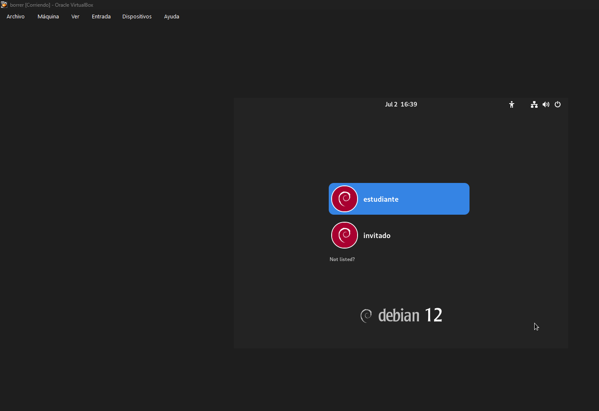
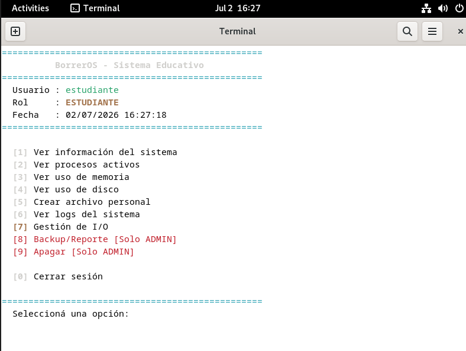
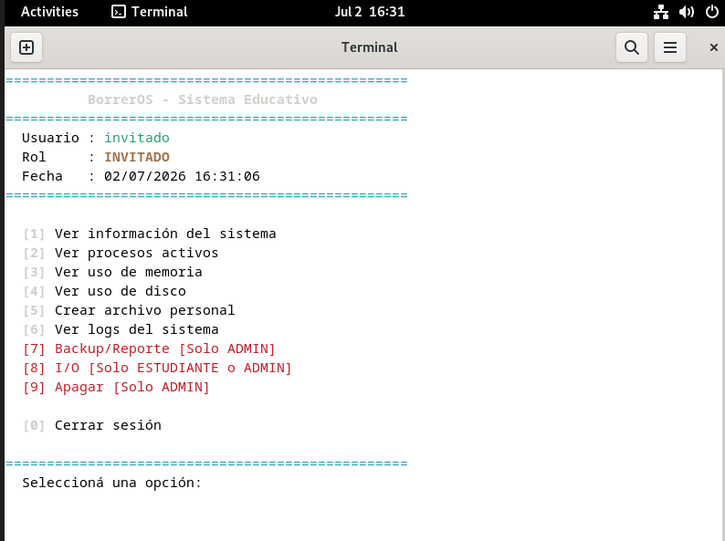

10. Capturas de Funcionamiento
==============================

.. note::
   Esta sección se completó con capturas de pantalla reales del
   sistema funcionando.

10.1 Arranque de BorrerOS en VirtualBox
---------------------------------------

.. code-block:: bash

   # Comando usado para arrancar en QEMU (alternativo)
   cd ~/borrerOS && qemu-system-x86_64 -hda borreros.img -m 2G -smp 2 -accel tcg,thread=multi

10.2 Menú principal — Usuario ``estudiante``
---------------------------------------------

El menú muestra las opciones disponibles según el rol del usuario.
Las opciones exclusivas de ``adminso`` aparecen en rojo e inaccesibles
para roles menores.

10.3 Menú principal — Usuario ``invitado``
------------------------------------------

